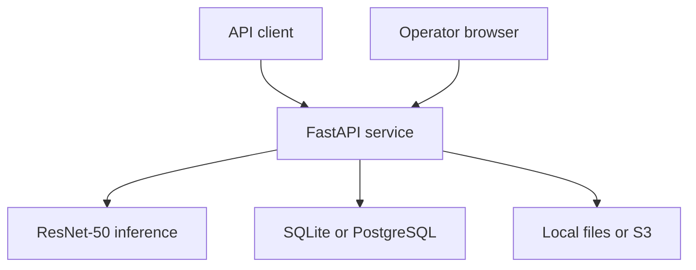
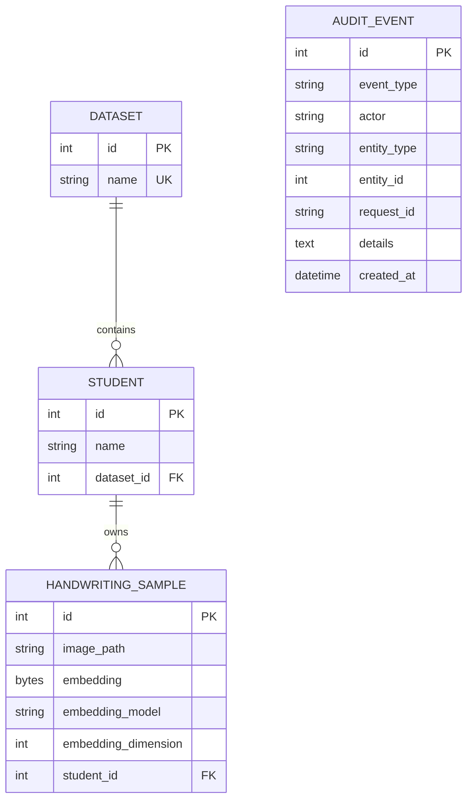

# Architecture

## System context

InkID is a synchronous FastAPI service with two interfaces:

- a JSON/multipart REST API for integrations;
- a server-rendered operator console at `/admin`.

## Component responsibilities

| Component | Responsibility |
|---|---|
| `app/main.py` | Application assembly, health endpoints, prediction orchestration, and operator routes |
| `app/routers/` | Dataset, writer, sample, and audit REST endpoints |
| `app/crud.py` | Transactional database operations and domain-level duplicate/validation errors |
| `app/models.py` | SQLAlchemy entities and relationships |
| `app/schemas.py` | Request and response validation contracts |
| `app/uploads.py` | Bounded upload streaming, image decoding checks, and safe temporary paths |
| `app/storage.py` | Local and S3 persistence/deletion abstraction |
| `app/ml.py` | Lazy model loading, preprocessing, embeddings, cosine comparison, and writer aggregation |
| `app/security.py` | API-key, HTTP Basic, production fail-closed, and same-origin checks |
| `app/observability.py` | Request IDs, structured logs, and response security headers |
| `app/audit.py` | Authenticated actor and mutation/prediction audit events |
| `app/evaluation.py` | Leave-one-out evaluation of an enrolled dataset |
| `app/maintenance.py` | Audit retention and local orphan cleanup |
| `migrations/` | Versioned database schema managed by Alembic |

## Enrolment flow

1. The endpoint verifies that the writer exists.
2. The upload is streamed with a byte limit into a UUID-named temporary file.
3. Pillow verifies the decoded image format and pixel count.
4. ResNet-50 produces a 2,048-element float32 embedding.
5. The validated image is retained locally or uploaded to S3 with server-side encryption.
6. The locator, embedding bytes, model identifier, dimension, and writer relationship are committed to SQL.
7. An audit event records the actor, entity, event type, and request ID.
8. Failures remove temporary or already-persisted objects where possible.

## Identification flow

1. The query image passes the same validation pipeline and remains temporary.
2. InkID verifies the target dataset and extracts its query embedding.
3. Only stored embeddings with the current model identifier and dimension are eligible.
4. Cosine similarity is calculated against each eligible reference sample.
5. Sample scores are grouped by writer and the strongest scores are averaged.
6. The API returns up to three ranked writers. The best writer is accepted only when its score meets the supplied threshold.
7. The query image is deleted in a `finally` block and is never enrolled automatically.

## Data model

Writer names are unique within a dataset. Deleting a dataset cascades through writers and samples at the application/database relationship level, while the application also deletes corresponding stored objects.

## Runtime and scaling boundaries

- SQLite and local storage are appropriate for development or a single-instance demonstration.
- Multiple instances require PostgreSQL and S3-compatible shared storage.
- Model inference is synchronous and CPU-oriented in the supplied container.
- The model is loaded lazily once per process, so each worker has its own memory copy.
- Scale modest traffic vertically first. For sustained concurrency, introduce a bounded work queue and separate inference workers before increasing web-worker count.
- Migrations must run exactly once per release before new application replicas receive traffic.

## Important design decisions

- Reference images are retained to support traceability and future re-embedding; query images are temporary.
- Embedding version metadata prevents silent comparisons across incompatible model generations.
- Storage locators and raw embeddings are excluded from public response schemas.
- Authentication is intentionally simple and operator-oriented. It is not multi-tenant identity or granular RBAC.
- Audit events are operational records, not an immutable compliance ledger.
